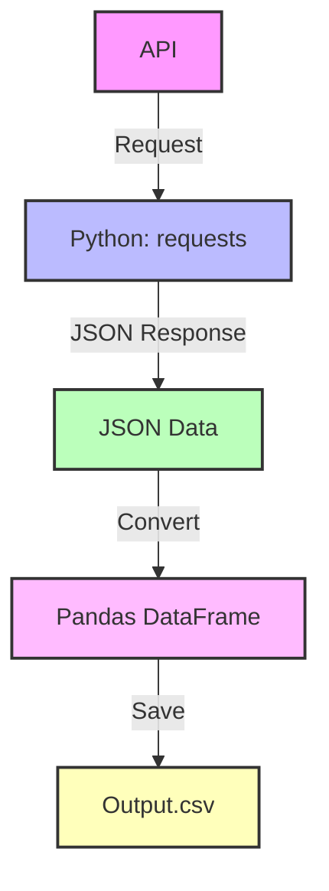

```
tenis_api_project/
    | __config/
    |   |__config.py
    |   |___ __init__.py
    |
    |__src/
    |   |__ __init__.py
    |   |__ api_client.py
    |   |__ data_processor.py
    |   |__ utils.py
    |
    |__tournaments/
    |   |__ output.csv
    |
    |__ docs/
    |   |__ Concepts.md
    |   |__ HowCreate.md
    |   |__ TipsForBetter.md
    |   |__WhyPandas.md
    |   |__WhyRestAPI.md
    |
    |__ requirements.txt
    |__ .env
    |__ run.py
    |__ README.md
```


```
[API] --> [Request (Python)] --> [JSON Data] --> [Pandas DataFrame] --> [Output.csv]
```
